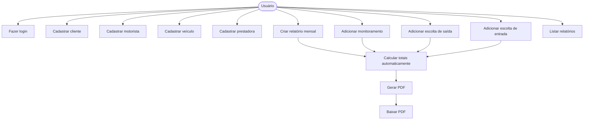
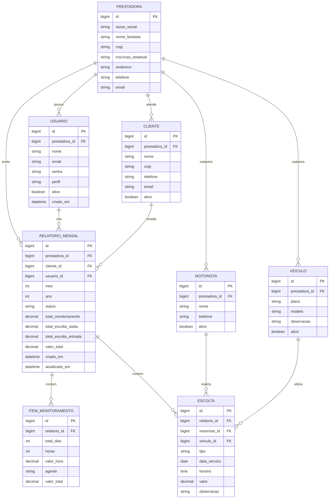
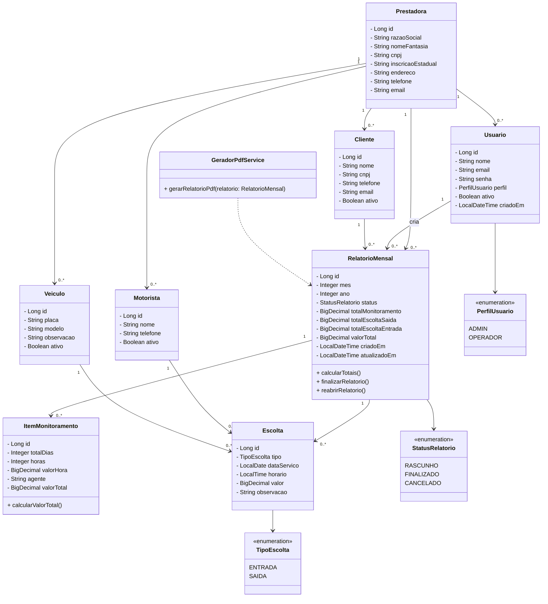

# Relatório Fácil Transportes

Sistema web para criação e geração automática de relatórios mensais de serviços de monitoramento e escolta.

O objetivo do projeto é substituir o preenchimento manual mensal de planilhas por uma aplicação web com login, cadastros, cálculos automáticos e geração de PDF pronto para envio.

---

## Sobre o projeto

Atualmente, relatórios mensais de transporte e monitoramento precisam ser preenchidos manualmente em planilhas, alterando mês, datas, motoristas, placas, valores e totais.

Este sistema foi pensado para facilitar esse processo. O usuário poderá acessar o sistema pelo navegador, cadastrar os dados necessários e gerar o relatório final em PDF automaticamente.

O projeto também será usado como exercício prático e projeto pessoal de portfólio, com foco em Java, Spring Boot, API REST, banco de dados e geração de relatórios.

---

## Funcionalidades planejadas

### MVP

- Login de usuário
- Cadastro de prestadora
- Cadastro de clientes
- Cadastro de motoristas
- Cadastro de veículos / placas
- Criação de relatório mensal
- Cadastro de operação de monitoramento
- Cadastro de escolta de entrada
- Cadastro de escolta de saída
- Cálculo automático dos totais
- Geração de relatório em PDF
- Listagem de relatórios criados

### Funcionalidades futuras

- Copiar relatório do mês anterior
- Dashboard com resumo mensal
- Histórico de PDFs gerados
- Filtros por mês, ano e cliente
- Envio de relatório por e-mail
- Controle de usuários por perfil
- Frontend responsivo para celular e computador

---

## Tecnologias previstas

### Backend

- Java 21
- Spring Boot
- Spring Web
- Spring Data JPA
- Spring Security
- JWT
- PostgreSQL
- Flyway
- Maven
- Lombok
- OpenPDF

### Frontend

- React
- Vite
- Tailwind CSS
- Axios
- React Hook Form
- Zod

### Banco de dados

- PostgreSQL

### Deploy futuro

- Frontend: Vercel
- Backend: Render, Railway ou Fly.io
- Banco: Supabase, Neon ou Railway PostgreSQL

---

## Arquitetura do sistema

```text
Usuário no navegador
        ↓
Frontend React + Vite + Tailwind
        ↓
Backend Spring Boot API REST
        ↓
PostgreSQL
        ↓
Gerador de PDF
```

O frontend será responsável pelas telas e formulários.

O backend será responsável pelas regras de negócio, autenticação, persistência dos dados, cálculos e geração do PDF.

---

## Estrutura sugerida do projeto

```text
relatorio-facil-transportes/
│
├── backend/
│   ├── src/main/java/br/com/ricardodev/relatoriofacil/
│   │   ├── config/
│   │   ├── controllers/
│   │   ├── dtos/
│   │   ├── entities/
│   │   ├── enums/
│   │   ├── repositories/
│   │   ├── services/
│   │   ├── security/
│   │   └── RelatorioFacilApplication.java
│   │
│   ├── src/main/resources/
│   │   ├── application.properties
│   │   └── db/migration/
│   │
│   └── pom.xml
│
└── frontend/
    ├── src/
    │   ├── components/
    │   ├── pages/
    │   ├── services/
    │   ├── routes/
    │   └── App.jsx
    │
    └── package.json
```

---

## Entidades principais

### Prestadora

Representa a empresa que emite o relatório.

Exemplos de dados:

- Razão social
- Nome fantasia
- CNPJ
- Inscrição estadual
- Endereço
- Telefone
- E-mail

### Usuário

Representa quem acessa o sistema.

Perfis previstos:

- ADMIN
- OPERADOR

### Cliente

Representa a empresa atendida no relatório mensal.

### Motorista

Representa os motoristas utilizados nas escoltas.

### Veículo

Representa as placas utilizadas nos serviços.

### Relatório Mensal

Representa o relatório de um determinado mês e ano para um cliente.

### Item de Monitoramento

Representa uma linha da seção de operação de monitoramento.

### Escolta

Representa uma escolta de entrada ou saída.

O campo `tipo` define se a escolta é:

- ENTRADA
- SAIDA

---

## Regras de negócio

### Relatório mensal

Cada relatório deve pertencer a uma prestadora, a um cliente e a um mês/ano específico.

Exemplo:

```text
Cliente: JJ SUL
Mês: Maio
Ano: 2026
```

### Escolta

Cada escolta deve conter:

- Tipo da escolta
- Data do serviço
- Horário
- Motorista
- Veículo / placa
- Valor
- Observação opcional

### Monitoramento

Cada item de monitoramento deve conter:

- Total de dias
- Horas
- Valor por hora
- Agente ou observação
- Valor total

O valor total do monitoramento pode ser calculado com a regra:

```text
totalDias * horas * valorHora
```

### Totais do relatório

O sistema deve calcular automaticamente:

- Total de monitoramento
- Total de escoltas de saída
- Total de escoltas de entrada
- Valor total geral

Regra:

```text
valorTotal = totalMonitoramento + totalEscoltaSaida + totalEscoltaEntrada
```

---

## Diagrama de Caso de Uso



---

## DER - Modelo do Banco de Dados



---

## UML - Diagrama de Classes



---

## Endpoints planejados

### Autenticação

```http
POST /auth/login
POST /auth/register
```

### Prestadora

```http
GET    /prestadoras
POST   /prestadoras
GET    /prestadoras/{id}
PUT    /prestadoras/{id}
```

### Clientes

```http
GET    /clientes
POST   /clientes
GET    /clientes/{id}
PUT    /clientes/{id}
DELETE /clientes/{id}
```

### Motoristas

```http
GET    /motoristas
POST   /motoristas
GET    /motoristas/{id}
PUT    /motoristas/{id}
DELETE /motoristas/{id}
```

### Veículos

```http
GET    /veiculos
POST   /veiculos
GET    /veiculos/{id}
PUT    /veiculos/{id}
DELETE /veiculos/{id}
```

### Relatórios

```http
GET    /relatorios
POST   /relatorios
GET    /relatorios/{id}
PUT    /relatorios/{id}
DELETE /relatorios/{id}
POST   /relatorios/{id}/finalizar
POST   /relatorios/{id}/reabrir
GET    /relatorios/{id}/pdf
```

### Monitoramentos

```http
POST   /relatorios/{id}/monitoramentos
PUT    /monitoramentos/{id}
DELETE /monitoramentos/{id}
```

### Escoltas

```http
POST   /relatorios/{id}/escoltas
PUT    /escoltas/{id}
DELETE /escoltas/{id}
```

---

## Layout esperado do PDF

O relatório final deve conter:

- Cabeçalho da prestadora
- Mês e ano do relatório
- Cliente
- Tabela de operação de monitoramento
- Tabela de escolta de saída
- Tabela de escolta de entrada
- Subtotais por seção
- Valor total final
- Data de geração

Estrutura esperada:

```text
RELATÓRIO MENSAL DE: Maio / 2026
EMPRESA: JJ SUL
OPERAÇÃO: Operação de Monitoramento

OPERAÇÃO DE MONITORAMENTO
TT. DIAS | HS | VLR HR | AGENTES | VLR

ESCOLTA DE SAÍDA
DIA | HORÁRIO | MOTORISTA | PLACA | VALOR

ESCOLTA DE ENTRADA
DIA | HORÁRIO | MOTORISTA | PLACA | VALOR

VALOR TOTAL DOS SERVIÇOS PRESTADOS EM 05/2026
R$ 15.180,00
```

---

## Ordem recomendada de desenvolvimento

### Fase 1 - Base do backend

- Criar projeto Spring Boot
- Configurar PostgreSQL
- Configurar Flyway
- Criar enums
- Criar entidades
- Criar repositories
- Criar migrations

### Fase 2 - CRUDs básicos

- CRUD de prestadora
- CRUD de cliente
- CRUD de motorista
- CRUD de veículo

### Fase 3 - Relatório mensal

- Criar relatório
- Adicionar monitoramento
- Adicionar escolta
- Calcular totais
- Listar relatórios

### Fase 4 - Geração de PDF

- Criar serviço gerador de PDF
- Montar layout do relatório
- Criar endpoint de download
- Testar PDF com dados reais

### Fase 5 - Segurança

- Criar autenticação
- Configurar Spring Security
- Configurar JWT
- Proteger endpoints

### Fase 6 - Frontend

- Criar projeto React
- Criar tela de login
- Criar dashboard
- Criar telas de cadastro
- Criar tela de relatório
- Integrar frontend com API

### Fase 7 - Deploy

- Deploy do banco
- Deploy do backend
- Deploy do frontend
- Configurar variáveis de ambiente
- Testar em celular e computador

---

## Status do projeto

Em desenvolvimento.

Primeira etapa: construção do backend com Java e Spring Boot.

---

## Autor

Desenvolvido por Ricardo Rodrigues Santana como projeto pessoal de estudo e portfólio.

